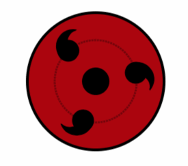
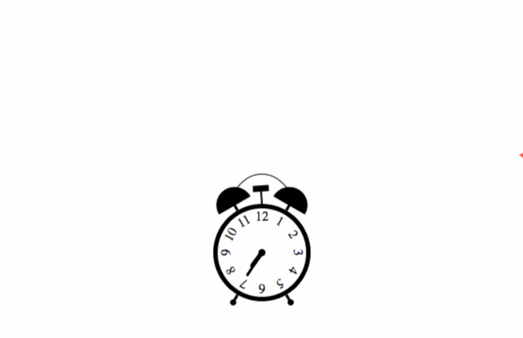

# CS 559 Computer Graphics

I took this course in Fall 2017 with Professor Eftychios Sifakis. It is one of my favorite classes taken in UW-Madison. Computer graphic is really rewarding and inspiring. The requirement of each project can be found [here](http://graphics.cs.wisc.edu/WP/cs559-fall2017/category/assignments/).

The tools I am using are HTML canvas and webGL. Projects include 2D graphics, fake 3D and real 3D graphics. We are also taught to make our own shaders and load 3D object and map textures.

Since some GIF's are quite large, rendering this README page takes some time. You can click the link inside the table below to view the interactive version.

Really appreciate Professor [Michael Gleicher](http://pages.cs.wisc.edu/~gleicher/)'s effort for making the graphic town skeleton code and redesigning this course in 2015! 🎉

|[ <b>Project 1</b>](http://jayw-www.cs.wisc.edu/cs559/p1/project1.html)|[ <b>Project 2</b>](http://jayw-www.cs.wisc.edu/cs559/p2/project2.html)|[ <b>Project 3</b>](http://jayw-www.cs.wisc.edu/cs559/p3/project3.html)|
|:---:|:---:|:---:|
|[ <b>Project 4</b>](http://jayw-www.cs.wisc.edu/cs559/p4/project4.html)|[ <b>Project 5</b>](https://goo.gl/o9xbbg)|[ <b>Project 6</b>](http://jayw-www.cs.wisc.edu/cs559/p6/project6.html)|
|[ <b>Project 7</b>](http://jayw-www.cs.wisc.edu/cs559/p7/)|[ <b>Project 8</b>](http://jayw-www.cs.wisc.edu/cs559/p8/)|[ <b>Project 9-10</b>](http://jayw-www.cs.wisc.edu/cs559/p10/)|